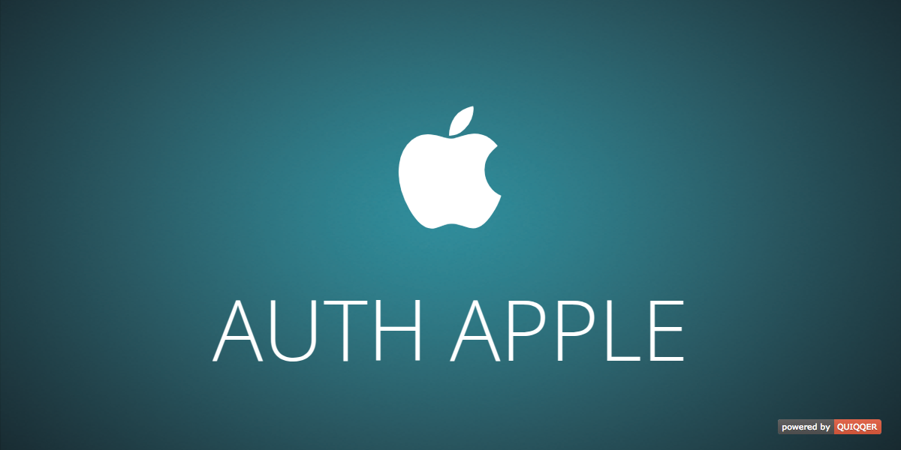

QUIQQER Apple authentication and registration
=============================================

This module provides a registrar (registration option) for the `quiqqer/frontend-users` module. Users can sign up using their Apple account.

This module further provides an authentication for QUIQQER. Users can sign in using their Apple account.

**Package Name:** `quiqqer/authapple`

Features
--------

* Registration via Apple account (requires `quiqqer/frontend-users`)
* Authentication via Apple account

Installation
------------

The Package Name is: `quiqqer/authapple`

Contribute
----------

- Project: https://dev.quiqqer.com/quiqqer/authapple
- Issue Tracker: https://dev.quiqqer.com/quiqqer/authapple/issues
- Source Code: https://dev.quiqqer.com/quiqqer/authapple/tree/main

Support
-------

If you have found errors, wishes or suggestions for improvement,  
you can contact us by email at **support@pcsg.de**.  
We will transfer your message to the responsible developers.

License
-------

GPL-3.0+
